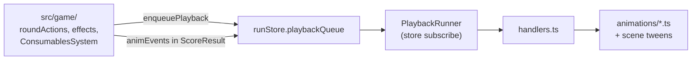

# Wagon Bones — Animation Reference

How visual feedback is wired: **game logic** in `src/game/` emits data (`ScoreAnimEvent`, `PlaybackCommand`, `ConsumableAnimEvent`); **Phaser** in `src/phaser/` plays it. Logic does not duplicate scoring math in the UI layer.

For architecture rules, see [AGENTS.md](AGENTS.md) (playback queue, score events, scene binding).

---

## Architecture

| Layer | Role |
|-------|------|
| `src/game/playback/types.ts` | `PlaybackCommand` union — one FIFO item per UI beat |
| `src/game/playback/queue.ts` | `enqueuePlayback` / `takePlayback` |
| `src/phaser/playback/PlaybackRunner.ts` | Subscribes to queue length; drains **auto** commands; scenes call `drainMatching` for manual steps |
| `src/phaser/playback/handlers.ts` | Maps each command kind → animation module |
| `src/phaser/animations/*` | Shared scoring, equipment, hand-upgrade, toast modules |
| Scene tweens | Roll, layout, trail results, shop buy, etc. (often not queued) |

**Scenes that bind `bindScenePlaybackRunner`:** `Game`, `Shop`, `BoosterPack`, `Payout`, `TrailEvent`, `RoundSelect`.

**Manual drains (not auto):**

- `score-events` with `label: 'round-end-held'` — after leg ends, before modifier feedback
- `day-end-destructions` — Dynamite / Nitro self-destruct at day end
- Round Select / Booster Pack sometimes `drainMatching` for tags, hand upgrades, consumable playback

Timing knobs live in `ANIM` in `src/game/Constants.ts` (roll, score steps, fire destruction, card hover).

---

## Playback queue (`PlaybackCommand`)

Defined in `src/game/playback/types.ts`. Enqueued from `roundActions`, `playbackEnqueue.ts`, `uiEffectHelpers`, `ConsumablesSystem` (`enqueueToastFeedback`), `facade/pack.ts`, etc.

| Kind | Typical trigger | Phaser handler | What the player sees |
|------|-----------------|----------------|----------------------|
| `dice-added` | Round start adds dice (e.g. Mystery Crate) | `onDiceAdded` in GameScene | IDs stored; **pop-in** runs in `animateNewDiceAppearing` (not in handler) |
| `round-start-destructions` | Funeral Pyre, Haunted Totem, … | `animateEquipmentFireDestructionSequence` | Source card shakes; victim **burns** (particles + shrink) |
| `round-start-equipment-created` | Junk Dealer | `animateEquipmentPopIn` | Last N equipment cards scale in (`sfx_card1`) |
| `equipment-created` | Indexed pop-in | Same (count = indices length) | Pop-in for new slots |
| `equipment-created-count` | Pack / consumable grant | `playEquipmentCreatedPopIn` | Pop-in without slot list |
| `equipment-destroyed` | *(handler exists; rarely enqueued)* | Single fire destruction | One source → victim burn |
| `consumable-playback` | Use card (Skin Walker, raid dice, …) | `applyConsumableAnimEvents` + optional pop-in | Dice fire destruction and/or parallel equipment burn; then new gear pop-in |
| `hand-upgrades` | Trail guide, tags, Surveyor/Trickster score, pack instant | `playHandUpgradeAnimation` | Sidebar panel: hand name, miles/mult/level tick up or down |
| `score` | `calculateScore` | `playScoreAnimation` | Full Balatro-style score sequence (below) |
| `score-events` | Round-end held dice payouts | `playDieAnimEvents` | Subset of score FX (no sidebar tally); optional `round-end-held` label |
| `day-end-destructions` | Dynamite, Nitro at `endDay` | Fire destruction per index + floating “destroyed” | Sequential self-burn; state applied with `deferStateUpdate` |
| `tag-earned` | Skip round on Round Select | `playTagEarnedFlyIn` | Colored badge flies from round column → tag stack |
| `modifier-feedback` | Leg end leased/perishable | Lease flash, perishable warning, modifier crumble | “Spoiled!” / “Repossessed!” on cards; lease badge pulse |
| `toast` | Fool's Gold, Bless, … | `playCenterToast` | Center success/failure text (`sfx_coin` / `sfx_cancel`) |

**Score order in one hand:** `hand-upgrades` (if any) → `score` (queued in that order in `roundActions.submitScore`). Hand-upgrade panel uses the **sidebar** overlay; scoring waits on `scoreLayoutGate` until dice finish moving to the score line.

---

## Score animation system

### Data: `ScoreAnimEvent`

`src/game/types.ts` — built during `scoreHand` / effect handlers / `onPreScoring`. Played by `ScoreAnimation.ts` (full hand) or `playDieAnimEvents` (held-only follow-up).

| `popupType` | Logic examples | Visual / audio |
|-------------|----------------|----------------|
| `miles` | Per-die pips, equipment additive miles, icy aura | Blue `+N mi` above die or below card; sidebar miles pill scales + shakes; `sfx_chips2` |
| `mult` | Additive mult, fire aura (+10) | Red `+N mult`; mult pill shake; `sfx_multhit1` |
| `xmult` | Equipment xMult, holy aura (1.5), Graverobber after strip | `xN mult`; mult pill shake (xMult style); `sfx_multhit2` |
| `money` | Gold die, held money effects | Gold `+$N`; `sfx_coin` |
| `supply` | Grants supply/frontier card | Popup + **ghost card** tweens to consumable bar; `sfx_tarot1`; `consumableActions.addConsumable` on arrival |
| `trail_guide` | Blue moon, etc. | Same fly-in to bar (trail guide atlas) |
| `enhance` | Golden Spike, Lucky Find, Echo Chamber | Die shake; cyan `+{Enhancement Name}`; `setDieData` with enhancement/aura/sticker; source equip wiggle; `sfx_foil1` |
| **`strip`** | **Graverobber** (`GRAVEROBBER_XMULT` pre-scoring) | Die **alpha flash** (yoyo); `enhancement: null` on sprite — standard face art; quiet `sfx_chips1`; then separate `xmult` on Graverobber card |
| `crack` | Glass/diamond crack, destruction | `CRACK!` text; **shard + mist particles**; die shrinks/fades; removed from sprite map; `sfx_glass1` |
| `balance` | Accountant profession | `Balance!` between sidebar pills; miles & mult set to averaged value; both pills shake |
| `again` | Retriggers (Silver Bullets, Seventh Trumpet, …) | Equip card **aggressive shake** + `Again!` (trimmed to wiggle when score is accelerated) |

**Targets:** `die`, `equip`, `both`, or `balance` (sidebar center).

**Pacing:** `scoreAnimPacing.ts` compresses gaps when `animEvents.length` is large (`ANIM.SCORE_ACCEL_*`). Same session scale carries into `round-end-held` playback.

**Finish:** Sidebar round score animates up; `sfx_timpani`; then GameScene `onScoreComplete` → Continue.

### Pre-score strip (Graverobber) — logic vs visuals

1. **Logic** (`onPreScoring.ts`): For each scoring die with an enhancement, push `strip` then `xmult` on Graverobber; strip mutations on scoring dice immediately so later passes do not apply bone/wooden/etc.
2. **Visual** (`ScoreAnimation.ts` `popupType === 'strip'`): No floating label — flash + revert die texture to standard.
3. Order relative to Golden Spike / Echo Chamber follows **equipment bar order** (see `animEvents.test.ts`).

### Equipment auras during score

Not separate VFX types — they append normal popups in `applyEquipmentAuraForSlot` (`helpers.ts`):

- **Fire:** `+10 mult` on that card
- **Icy:** `+50 mi` on that card  
- **Holy:** `x1.5 mult` in holy pass (`applyHolyAuraXMult`)

Persistent **glow + particles** on cards/dice come from `AuraFX.ts` (`ItemCard`, `DiceSprite`), not from the score step loop.

### Held-in-hand / round end

- During score: held effects use same `animEvents` stream when those dice/equipment fire.
- After last day when leg ends: `score-events` + `label: 'round-end-held'` — `playDieAnimEvents` (money, supply fly-in, again; no full sidebar scoring).

---

## Module reference (`src/phaser/animations/`)

| File | Purpose |
|------|---------|
| `RollAnimation.ts` | Rapid random faces → final values; `sfx_dice_roll` / `sfx_dice_land`; per-die bounce scale |
| `ScoreAnimation.ts` | Sequential score playback, floating popups, crack/strip/enhance/grants |
| `HandUpgradeAnimation.ts` | Sidebar overlay panel; upgrade vs downgrade colors/SFX |
| `EquipmentFireDestroyAnimation.ts` | Fire particles (`aura_soft`), ambient fire + slice SFX, victim fade; parallel variant for consumables |
| `EquipmentPopInAnimation.ts` | New cards: scale 0 → `UI.EQUIP_CARD_SCALE`, staggered 150 ms |
| `ConsumableAnimPlayback.ts` | Chains `destroy_dice` → `destroy_equipment` events |
| `ToastAnimation.ts` | Center toast for playback `toast` command |
| `scoreAnimPacing.ts` | Gap compression + `trimFx` for long hands |

---

## Game scene (`GameScene.ts`) — non-queue motion

| Trigger | Effect | Attached to |
|---------|--------|-------------|
| Ready to roll → `enterRollPhase` | `playRollAnimation` on all roll sprites | Dice row |
| Re-roll subset | `playRollAnimation` on unlocked sprites only | Dice row |
| Score hand | `layoutDiceForScoring` — selected dice to score Y; held dice to roll arc | `DiceSprite` tweens; releases `scoreLayoutGate` |
| Next day draw | `enterDrawPhase(true)` — new dice from pouch launch point; carryover dice keep position | Pouch → play area |
| `dice-added` playback + pending IDs | `animateNewDiceAppearing` — scale pop-in, Mystery Crate card wiggle, “✨ New Die Added!” | Play area + equip bar |
| Consumable destroy dice | `animateConsumableDiceDestruction` — fire particles, lift/fade (same language as equip fire) | Target sprites |
| Day-end destruction fallback | `showFloatingText` “💥 {name} destroyed!” | Center (when not using deferred queue) |
| Select/reroll die | Lift Y, depth, arc reposition | Roll / select sprites |
| Marquee drag | Semi-transparent rect over roll zone | `MARQUEE` graphics |
| Validation errors | `showFloatingText` | Center, drifts up |
| Boss / bounty | Disabled visuals on `DiceSprite` | Per-die |

---

## Trail events (`TrailEventScene.ts`)

No playback queue for narrative resolution — **scene-local tweens** after `resolveChoice`.

| Trigger | Effect |
|---------|--------|
| Negative effect line | Text shake (horizontal jitter) |
| Result panel | Container fade-in (`alpha` 0 → 1) |
| `LOSE_RANDOM_DICE` | `animateDiceLoss` — red placeholder die + skull, fade/scale down, red dot “particles”, `sfx_explosion` |
| `GAIN_DICE` | `animateDiceGain` — green die pop-in, then tween toward **pouch** corner, `sfx_coin` |
| Sacrifice equipment choice | Selected `ItemCard` shrinks to 0, `sfx_explosion`, rebuild picker |
| Negation / protection | Extra message text (omen, Saint Elmo's, repair kit) |
| SFX | `sfx_negative` vs `sfx_coin` from effect polarity |

**Scout's Spyglass** (`SpyglassTrailPreview.ts`): Static **circular** baked trail art (cover crop + gold ring) — not a tween; Avoid / Investigate buttons. Investigate stores miles on the item; no hand-upgrade animation in this scene.

**BOSS_UPGRADE** trail effects: Modifier only (higher boss target miles) — **no dedicated animation**; may appear as a text line in the effect summary.

**Hand level from trail content:** If a consumable/tag enqueues `hand-upgrades`, animation runs when a scene with `PlaybackRunner` drains that command (e.g. Round Select skip rewards, Shop/Booster use) — same `HandUpgradeAnimation` as in-game scoring.

---

## Hand upgrade animation (trail guides, tags, scoring)

**Triggers (enqueue `hand-upgrades`):**

- Trail guide / Spiritual Journey / boss downgrade consumables (`enqueueConsumablePlayback`)
- Skip-round tags with hand XP (`RoundSelectScene.processImmediateTagFlow`)
- Pre-score or post-score equipment (`roundActions` — Surveyor's Transit, Trickster, etc.)
- Booster pack instant effects (`facade/pack.ts`)

**Look:** Floating panel in left sidebar (`getHandUpgradeY()`): hand name, level, base miles, base mult tick with scale pops; downgrade uses red palette + `sfx_negative` / `sfx_cancel`. Fades out after hold, then next upgrade or complete.

---

## Equipment bar & cards (`EquipmentBar`, `ItemCard`, `CardBar`)

| Effect | Trigger | Look |
|--------|---------|------|
| Idle wobble | All bar cards | Slow rotation sway (`ANIM.CARD_WOBBLE_*`) |
| Hover tilt | Pointer over card | 3D-ish tilt + lift (`CARD_TILT_*`) |
| Drag reorder | Equipment/consumable bars | Swing on drag, settle tween |
| Action tabs | Hover card | Slide-out tabs (`sfx_whoosh`) |
| Sell | Sell tab | Fling off-screen + crumple/coin SFX |
| Fire destruction | Playback / round start | See `EquipmentFireDestroyAnimation` |
| Modifier destruction | Perished / repossessed | “Spoiled!” / “Repossessed!” popup + card crumble (`sfx_explosion`) |
| Lease paid | Modifier feedback | Leased badge scale pulse |
| Perishable warning | One round left | Orange badge pulse |

---

## Consumables & shop

| Location | Animation |
|----------|-----------|
| Shop buy equipment/die/consumable | Card shrinks/fades (`Power3`); pack opens with burst + `sfx_explosion_release` → `BoosterPack` scene |
| Shop hover | Card scale 1.05 |
| Booster pack lineup | Drag reorder tweens; card pick → tabs; `markCardUsed` gray overlay |
| Booster instant / targeting | Drains `consumable-playback`, `hand-upgrades`, `equipment-created-count` |
| Consumable use (any scene with runner) | Queue path above; failure uses `consumableResult.showConsumableFailure` (float up, fade) |
| Dice selection scene | Selected dice lift on Y (`UI.DICE_LOCKED_LIFT_Y`) |

---

## Dice presentation (`DiceSprite`, `AuraFX`)

| Feature | Behavior |
|---------|----------|
| Faces | Texture per `dice_{enhancement}` or `dice_standard` |
| Stone | Shows 0 during roll tumble |
| Aura | Glow filter + particles (holy/fire/icy/ghost palettes) |
| Sticker | Orbits die (`STICKER_ORBIT_*`) unless preference disables |
| Selected / score presentation | Stroke, filler row, depth |
| Reroll lock | 🔒 label below die |
| Tooltips | On hover (suppressed during drag) |

Crack/destruction during score uses world position of die for particles.

---

## Tags (`tagEarnedPlayback.ts`)

Skip round → `enqueueTagEarned` → colored rounded square flies from **round column center** to **tag stack anchor** (600 ms `Back.easeIn`). Colors by tag category (`shop`, `boss`, `next_round`, …).

---

## Payout & other scenes

| Scene | Animation notes |
|-------|-----------------|
| `PayoutScene` | Static breakdown panel; playback runner for consumables only |
| `RoundSelectScene` | Tag fly-in; immediate money float-up text; hand-upgrade drain |
| `ProfessionSelectScene` | Starting dice preview sprites (no full roll anim) |
| `DiceSelectionScene` | Selection lift tweens only |

---

## Audio map (scoring & destruction)

| Event | Sound |
|-------|-------|
| Miles | `sfx_chips2` (detune per step) |
| Mult | `sfx_multhit1` |
| xMult | `sfx_multhit2` |
| Money | `sfx_coin` |
| Supply / trail guide | `sfx_tarot1` |
| Enhance | `sfx_foil1` |
| Crack | `sfx_glass1` |
| Again | `sfx_multhit2` (detuned) |
| Hand score start | `sfx_chips1` |
| Hand complete | `sfx_timpani` |
| Equip fire | `sfx_ambient_fire`, `sfx_slice1` |
| Roll | `sfx_dice_roll`, `sfx_dice_land` |
| Pop-in card | `sfx_card1` |

---

## Adding a new scored effect animation

1. In the effect handler (or `scoreHand`), `ctx.animEvents.push({ target, popupType, value, … })`.
2. If new `popupType`, extend `ScoreAnimPopupType` in `types.ts` and handle it in `ScoreAnimation.animateEvent` (+ sound in `getSoundForType`).
3. For equipment/dice destruction outside scoring, prefer `ConsumableAnimEvent` or `PlaybackCommand` over ad-hoc scene code.
4. Push `ctx.animEvents` only in logic; do not recompute scores in Phaser.

---

## Related docs

- [GAME_OVERVIEW.md](GAME_OVERVIEW.md) — scoring order
- [AGENTS.md](AGENTS.md) — playback runner, test expectations
- [SCOUTS_SPYGLASS_UPDATE.md](SCOUTS_SPYGLASS_UPDATE.md) — spyglass UX design
